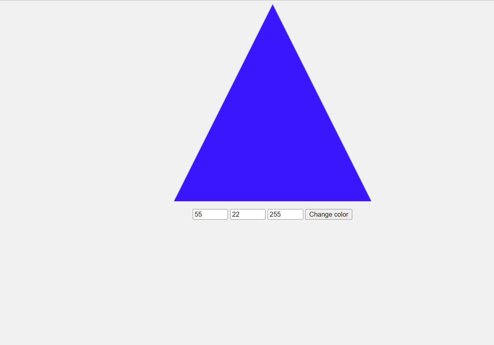

# webassembly-webgl-viewer



This project demonstrates how to use WebAssembly to create a WebGL viewer. The viewer is implemented as a Rust library that is compiled to WebAssembly. The viewer can be used to display 2D models in a web browser.

to build project you need wasm-pack installed on your machine. 
then run the following command to build pkg folder:

```shell
wasm-pack build --target web
```

then go and run web/index.html file in your browser

## Conclusion

The WebAssembly WebGL viewer is a powerful tool for creating 3D web applications. By using WebAssembly, you can create web applications that are fast, efficient, and portable.
